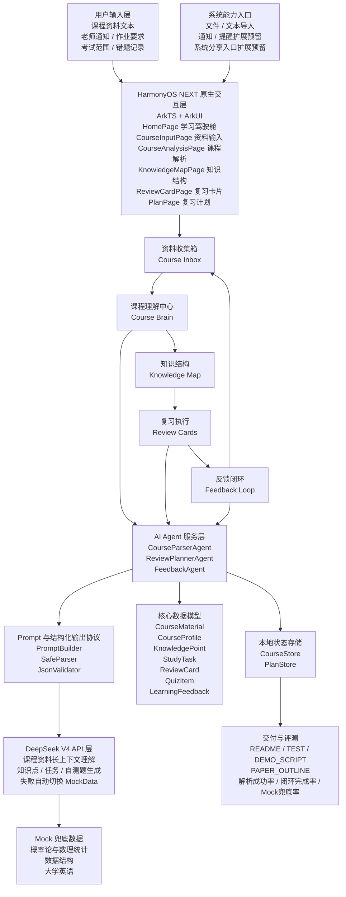

```mermaid
flowchart TB
    A[用户输入层<br/>课程资料文本<br/>老师通知 / 作业要求<br/>考试范围 / 错题记录]

    B[HarmonyOS NEXT 原生交互层<br/>ArkTS + ArkUI<br/>HomePage 学习驾驶舱<br/>CourseInputPage 资料输入<br/>CourseAnalysisPage 课程解析<br/>KnowledgeMapPage 知识结构<br/>ReviewCardPage 复习卡片<br/>PlanPage 复习计划]

    C[系统能力入口<br/>文件 / 文本导入<br/>通知 / 提醒扩展预留<br/>系统分享入口扩展预留]

    D[资料收集箱<br/>Course Inbox]
    E[课程理解中心<br/>Course Brain]
    F[知识结构<br/>Knowledge Map]
    G[复习执行<br/>Review Cards]
    H[反馈闭环<br/>Feedback Loop]

    I[AI Agent 服务层<br/>CourseParserAgent<br/>ReviewPlannerAgent<br/>FeedbackAgent]

    J[Prompt 与结构化输出协议<br/>PromptBuilder<br/>SafeParser<br/>JsonValidator]

    K[DeepSeek V4 API 层<br/>课程资料长上下文理解<br/>知识点 / 任务 / 自测题生成<br/>失败自动切换 MockData]

    L[核心数据模型<br/>CourseMaterial<br/>CourseProfile<br/>KnowledgePoint<br/>StudyTask<br/>ReviewCard<br/>QuizItem<br/>LearningFeedback]

    M[本地状态存储<br/>CourseStore<br/>PlanStore]

    N[Mock 兜底数据<br/>概率论与数理统计<br/>数据结构<br/>大学英语]

    O[交付与评测<br/>README / TEST / DEMO_SCRIPT<br/>PAPER_OUTLINE<br/>解析成功率 / 闭环完成率 / Mock兜底率]

    A --> B
    C --> B
    B --> D
    D --> E
    E --> F
    F --> G
    G --> H
    H --> D

    E --> I
    G --> I
    H --> I
    I --> J
    J --> K

    I --> L
    I --> M
    K --> N
    M --> O
```

